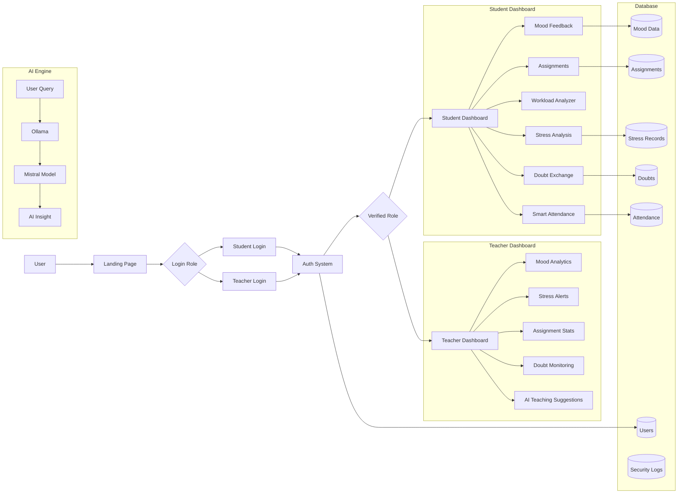

# AcademicIntel AI – System Flow Documentation

## Overview

**AcademicIntel AI** is a modern AI-powered academic intelligence platform designed for universities.
The platform provides **real-time classroom analytics, student stress monitoring, smart attendance, and assignment tracking** using interactive dashboards.

The system is built using:

* Next.js 14 (App Router)
* TailwindCSS
* Glassmorphism UI
* Lucide Icons
* Chart.js / Recharts
* Ollama Local AI Models (Mistral)

The architecture follows a **component-based SaaS dashboard model** with separate student and teacher interfaces.

---

# 1. System Entry Flow

Users first enter the platform through the **Landing Page**, where they are introduced to the AcademicIntel AI platform.

Users must then select their role and authenticate.

### Entry Process

1. User opens the platform
2. Landing page introduces the platform
3. User selects login role
4. Authentication system verifies credentials
5. User is redirected to the appropriate dashboard

---

# 2. System Flow Diagram



---

# 3. Student Dashboard Flow

After successful login, students are redirected to the **Student Dashboard**.

### Modules Available

#### 1. Mood Feedback System

Students can submit classroom feedback.

Options:

* Confused
* Bored
* Interested
* Too Fast
* Too Slow

Rules:

* One submission per IP per lecture session.

Stored in:
`Mood Data Database`

---

#### 2. Assignment Submission Portal

Students can:

* Upload assignments
* Track deadlines
* View submission history
* Monitor late submissions

Data stored:

* student_id
* ip_address
* timestamp
* deadline
* submission_status
* delay_time

---

#### 3. Workload Analyzer

Displays workload analytics:

* Assignments per week
* Late submissions
* Pending tasks

Formula:

```
workload_score =
(assignments_per_week * 2)
+ (late_submissions * 3)
+ (missed_assignments * 5)
```

Displayed using:

* Progress meter
* Charts

---

#### 4. Personal Stress Analysis

Stress is calculated using:

* Mood feedback history
* Assignment delays
* Workload score
* Academic performance trend

Stress levels:

* Low Stress
* Moderate Stress
* High Stress
* Burnout Risk

Charts:

* Stress trend line
* Behavioral analytics

---

#### 5. Anonymous Doubt Exchange

Students can:

* Post anonymous doubts
* Answer other students
* Upvote helpful answers
* Tag subjects

Example tags:

* #math
* #datastructures
* #signalsystems
* #os

Doubts become **Solved** when enough upvotes are received.

---

#### 6. Unparliamentary Word Filter

If abusive language is detected:

The system removes anonymity and sends the message to the teacher with:

* Student name
* Student ID
* Original message

Clean messages remain anonymous.

---

#### 7. Smart Attendance System

Attendance flow:

1. Student opens attendance page
2. Camera captures image
3. Face recognition checks student dataset
4. IP address validation
5. Attendance recorded

Restrictions:

* Only college WiFi allowed
* One attendance per IP per class
* Face must match registered dataset

---

# 4. Teacher Dashboard Flow

Teachers access real-time classroom analytics.

### Modules Available

---

## 1. Classroom Mood Dashboard

Displays classroom engagement:

Charts include:

* Mood distribution pie chart
* Lecture engagement timeline

Metrics tracked:

* Confused percentage
* Interested percentage
* Bored percentage
* Lecture pace feedback

---

## 2. AI Teaching Suggestions

AI analyzes classroom data.

Example suggestions:

If confusion > 40%
→ Review previous concept

If boredom > 50%
→ Increase lecture pace

If "Too Fast" responses increase
→ Slow explanation

---

## 3. Student Stress Alert System

Teachers receive alerts when students show signs of burnout.

Example alert:

```
Student ID: STU104
Stress Level: High
Reasons:
- Multiple late assignments
- High confusion responses
- Increasing workload score
```

---

## 4. Assignment Analytics

Teachers can analyze:

* Assignment completion rates
* Late submissions
* Student workload distribution

Graphs include:

* Bar charts
* Pie charts
* Trend analysis

---

## 5. Doubt Activity Monitoring

Teachers can view:

* Popular doubts
* Active discussions
* Students needing support

---

# 5. AI Architecture

The platform uses **local AI inference**.

Architecture flow:

```
User Query
   ↓
Ollama Local AI Runtime
   ↓
Mistral Model
   ↓
AI Insight / Suggestion
```

Benefits:

* Local data privacy
* Faster response
* No cloud dependency

---

# 6. Database Structure

The system stores structured data across several tables.

| Table          | Purpose                            |
| -------------- | ---------------------------------- |
| Users          | Student and teacher authentication |
| Mood Data      | Classroom mood feedback            |
| Assignments    | Submission tracking                |
| Stress Records | Student stress analytics           |
| Attendance     | Face recognition attendance logs   |
| Doubts         | Anonymous Q&A posts                |
| Security Logs  | IP activity and moderation logs    |

---

# 7. Security Controls

Strict controls are implemented:

* One mood submission per IP per lecture
* One attendance entry per IP per class
* Spam detection for doubt posts
* Abusive language detection
* Activity logs for teacher monitoring

---

# 8. Visualization System

All analytics dashboards use **interactive charts**.

Graphs include:

* Mood distribution
* Stress trends
* Assignment workload
* Submission rates
* Classroom engagement

Libraries used:

* Chart.js
* Recharts

---

# 9. UI Design System

The interface uses **Glassmorphism UI**.

Design elements:

* Frosted glass cards
* Soft gradients
* Floating dashboards
* Blurred backgrounds
* Rounded edges
* Smooth hover animations

Color palette:

* White
* Baby pink
* Soft purple gradients

---

# 10. Summary

AcademicIntel AI is a **futuristic academic analytics platform** designed to improve classroom intelligence through:

* Real-time mood detection
* Student stress monitoring
* Smart attendance
* Assignment analytics
* AI teaching suggestions

The platform combines **AI insights, modern dashboards, and secure data architecture** to help universities create smarter classrooms.
